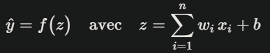
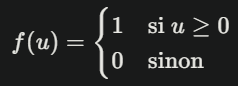
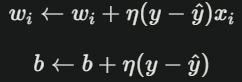

# Building Perceptron

> "The perceptron is capable of generalization and abstraction; it may recognize similarities between patterns which are not identical." - Frank Rosenblatt

# 📖 Contexte du Projet
Ce projet s'inscrit dans le cadre d'une initiation au Deep Learning à La Plateforme_. Il vise à comprendre et implémenter le Perceptron, le premier neurone artificiel inventé par Frank Rosenblatt, considéré comme la pierre angulaire de l'apprentissage automatique moderne.

L'objectif principal est de développer une compréhension approfondie des concepts fondamentaux du Machine Learning à travers l'implémentation d'un Perceptron en Python, puis de tester ce modèle sur un cas d'usage réel avec le dataset Breast Cancer Wisconsin.

# 🎯 Objectifs du Projet

## Phase 1 : Fondements Théoriques

### Machine Learning vs. Deep Learning : définitions et comparaison

#### Machine Learning (Apprentissage Automatique)

Le Machine Learning regroupe des méthodes permettant à une machine d’apprendre à partir de données sans être explicitement programmée pour chaque tâche. Les algorithmes classiques incluent :

- Régressions linéaires et logistiques
- Arbres de décision et forêts aléatoires
- SVM (Support Vector Machines)
- k-nearest neighbors

Ils reposent souvent sur des caractéristiques (features) ingénieusement extraites et nécessitent un prétraitement humain des données (sélection, transformation, normalisation).

#### Deep Learning (Apprentissage Profond)

Le Deep Learning est un sous-ensemble du Machine Learning qui utilise des réseaux de neurones profonds (plusieurs couches de neurones artificiels) capables d’apprendre automatiquement les représentations des données à différents niveaux d’abstraction (features hiérarchiques).

Aspect                            | Machine              | Learning Deep Learning              |
----------------------------------|----------------------|-------------------------------------|
Caractéristiques                  | Conception manuelle  | Apprentissage automatique           |
Complexité des données            | Modérée              | Très élevée (images, sons, textes…) |
Quantité de données               | Moyenne              | Grandes quantités requises          |
Puissance de calcul               | Ordinateur classique | GPU/TPU souvent nécessaires         |
Performances sur tâches complexes | Limitées             | Excellentes                         |

### Quand utiliser l’un plutôt que l’autre ?

#### Machine Learning

- Jeux de données petits à moyens
- Problèmes bien compris où les features manuelles sont efficaces
- Contraintes de puissance de calcul

#### Deep Learning

- Données volumineuses et non structurées (images, audio, texte)
- Besoin d’extraire des représentations complexes sans expertise métier poussée
- Disponibilité de ressources GPU et tolérance à des temps d’entraînement plus longs

### Applications du Deep Learning

Voici trois exemples emblématiques, inspirés d’AI Experiments et d’OpenAI :

#### 1. Diagnostic médical assisté par imagerie

Des réseaux de neurones convolutionnels (CNN) analysent des radiographies ou IRM pour détecter automatiquement des tumeurs ou anomalies. Cette approche accélère le diagnostic du cancer et améliore la précision des dépistages.

#### 2. Véhicules autonomes

Les systèmes embarqués s’appuient sur des CNN et des vision transformers pour reconnaître en temps réel les piétons, panneaux de signalisation et autres véhicules, permettant à la voiture de naviguer en toute sécurité sans intervention humaine.

#### 3. Traitement automatique du langage naturel (NLP)

Les modèles de type Transformers (GPT, BERT) gèrent la traduction, la génération de texte et les chatbots. Par exemple, ChatGPT comprend et produit un langage proche du dialogue humain pour l’assistance en ligne ou la création de contenu.

### Le Perceptron

##### Introduction

Le Perceptron est le premier modèle de neurone artificiel, mis au point par Frank Rosenblatt en 1957. Il sert de brique de base à l’apprentissage profond. Ce dossier explique pas à pas le fonctionnement du perceptron, ses limites, puis montre comment l’étendre et l’utiliser dans des contextes plus complexes.

#### 1. **Qu’est-ce qu’un Perceptron ?**

Un perceptron est un programme informatique qui imite grossièrement le comportement d’un neurone du cerveau :

- **Neurone biologique** : capte des signaux via des extensions appelées dendrites, les additionne dans le corps cellulaire, et, si le total dépasse un seuil, génère un signal électrique (potentiel d’action) transmis à d’autres neurones.

- **Perceptron** : reçoit des entrées numériques x1,x2,…,xn, multiplie chacune par un poids w1,w2,…,wn, ajoute un biais b, puis décide d’envoyer un “oui” (1) ou un “non” (0) selon le résultat.

Cette structure lui permet de distinguer deux catégories d’objets ou de données quand elles sont séparables par une ligne droite (en deux dimensions) ou un plan (en plusieurs dimensions).

#### 2. **Formule mathématique et signification des termes**

La décision du perceptron se calcule ainsi :

<div align="center">
   
</div>

- z : somme pondérée des entrées plus le biais (équivalent du potentiel d’action).
- f : fonction d’activation qui convertit z en 0 ou 1.
- wi : poids attribué à cette entrée (force du lien synaptique).
- xi : valeur de la i-ème entrée (ex. intensité d’un pixel).
- b : biais, permet de décaler la frontière de décision.

La fonction d’activation la plus simple est le seuil de Heaviside :

<div align="center">
   
</div>

#### 3. Comment apprend-on ?

L’apprentissage consiste à ajuster les poids wi et le biais b pour que le perceptron donne la bonne réponse sur des exemples connus. on utlise la règle d'apprentissage du perceptron (mise à jour des poids) :

<div align="center">
   
</div>

- η : taux d'apprentissage
- y : label attendu
- ŷ  : prédiction du perceptron

Ce formalisme est la base du perceptron simple, utilisé pour la classification binaire linéaire.

1. Calculer la sortie : ŷ = f(∑wi × xi + b)
2. Mesurer l'erreur : δ = y - ŷ  
3. Mettre à jour les poids : wi = wi + η × δ × xi
4. Mettre à jour le biais : b = b + η × δ
    où η est le taux d’apprentissage, un petit nombre (ex. 0,01) qui détermine la vitesse d’ajustement.

On répète ces étapes sur tous les exemples, plusieurs fois (plusieurs époques), jusqu’à obtenir un taux de bonnes réponses satisfaisant.

#### 4. Processus d’entraînement complet

1. Initialisation aléatoire : attribuer de petits poids et biais proches de zéro.
2. Boucle d’époques :
      - Pour chaque exemple :
            - Prédire y^
            - Calculer l’erreur δ
            - Ajuster wi et b

3. Vérification : arrêter si l’erreur moyenne tombe en-dessous d’un seuil ou après un nombre fixe d’époques.

#### 5. Limites du Perceptron

- Données linéairement séparables : il ne résout que les problèmes où une ligne ou un plan peut séparer les deux classes (ex. XOR n’est pas séparable).
- Convergence non garantie si les données ne satisfont pas cette condition.
- Frontière plane : incapable de modéliser des formes de séparation complexes.
- Sensibilité aux choix du taux d’apprentissage et à l’initialisation des poids.

#### 6. Aller plus loin : perceptrons multicouches et backpropagation

Pour traiter des données non linéaires, on assemble plusieurs perceptrons en couches :
- Chaque couche applique la même opération (somme pondérée + fonction d’activation) sur la sortie de la couche précédente.
- On appelle cela un réseau de neurones multicouches (MLP).
- L’algorithme de rétropropagation (backpropagation) calcule les dérivées de l’erreur par rapport à chaque poids en propageant l’erreur à rebours, puis ajuste tous les poids simultanément.

#### 7. Versions améliorées et bonnes pratiques

- Fonctions d’activation modernes : ReLU, tanh, sigmoïde, qui gèrent mieux le phénomène de gradient.
- Optimiseurs avancés : Adam, RMSProp, qui adaptent automatiquement le taux d’apprentissage.
- Régularisation : Dropout, weight decay, pour éviter le surapprentissage.
- Normalisation : Batch Normalization, pour stabiliser et accélérer l’entraînement.

#### 8. Exemples de code Python (orienté objet)

*python*
import numpy as np

class Perceptron:
    def __init__(self, n_inputs, lr=0.01):
        self.w = np.random.randn(n_inputs) * 0.01
        self.b = 0.0
        self.lr = lr

    def activation(self, z):
        return 1 if z >= 0 else 0

    def predict(self, X):
        z = np.dot(X, self.w) + self.b
        return self.activation(z)

    def train(self, X_train, y_train, epochs=100):
        for _ in range(epochs):
            for x, y in zip(X_train, y_train):
                y_pred = self.predict(x)
                delta = y - y_pred
                self.w += self.lr * delta * x
                self.b += self.lr * delta

Test rapide :
python
# Données factices
X = np.random.randn(200, 2)
y = np.where(X[:,0] + X[:,1] > 0, 1, 0)

model = Perceptron(n_inputs=2, lr=0.01)
model.train(X, y, epochs=50)

preds = np.array([model.predict(x) for x in X])
print("Précision :", np.mean(preds == y))

<div style="page-break-after: always;"></div>

## Phase 2 : Implémentation

- Développer une classe Perceptron en Python (programmation orientée objet)

- Tester le modèle sur des données factices générées aléatoirement

- Valider le fonctionnement de l'algorithme d'apprentissage

## Phase 3 : Application Pratique

- Analyser le dataset Breast Cancer Wisconsin

- Réaliser une analyse exploratoire complète des données

- Appliquer des techniques de réduction de dimensionnalité

- Évaluer les performances du Perceptron avec des métriques appropriées

- Proposer des améliorations pour optimiser les résultats

# 📊 Données Utilisées

**Dataset** : Breast Cancer Wisconsin
**Source** : UCI Machine Learning Repository

- Problématique : Classification binaire pour le diagnostic du cancer du sein

- Caractéristiques : 30 features numériques décrivant les caractéristiques des noyaux cellulaires

- Objectif : Prédire si une tumeur est bénigne ou maligne

## Approche d'Analyse

- Nettoyage des données : Gestion des valeurs manquantes et des outliers

- Analyse exploratoire : Visualisations et statistiques descriptives

- Réduction de dimensionnalité : Application de techniques appropriées

- Modélisation : Entraînement du Perceptron développé

- Évaluation : Métriques de performance adaptées au contexte médical

# 🛠️ Outils et Technologies

## Langages et Frameworks

- Python : Langage principal du projet

- NumPy : Calculs numériques et algèbre linéaire

- Pandas : Manipulation et analyse de données

- Matplotlib/Seaborn : Visualisation de données

- Scikit-learn : Preprocessing et métriques d'évaluation

# Techniques Appliquées

## Programmation Orientée Objet : Architecture modulaire du Perceptron

- Analyse Exploratoire : Compréhension approfondie des données

- Réduction de Dimensionnalité : Optimisation des features

- Validation Croisée : Évaluation robuste du modèle

# 📁 Structure du Repository

```
text
building-perceptron/
├── .env                    # environnement python
├── script.py                 # Classe Perceptron implémentée
├── notebook.ipynb           # Analyse complète et modélisation
├── README.md               # Documentation du projet
├── Data/                   # Données du projet
├── visualizations/         # Graphiques et visualisations
└── requirements.txt        # Dépendances Python
```

# 📈 Résultats et Conclusions

## Performance du Perceptron

[Insérer ici les métriques obtenues lors de l'évaluation]

## Limites Identifiées

Le Perceptron présente certaines limitations inhérentes :

- Capacité limitée aux problèmes linéairement séparables

- Sensibilité à l'initialisation des poids

- Convergence non garantie pour certains datasets

## Améliorations Proposées

- Implémentation du Perceptron multi-couches

- Utilisation de fonctions d'activation non-linéaires

- Application de techniques de régularisation

- Optimisation des hyperparamètres

# 📚 Bibliographie
## Ressources Académiques

- Rosenblatt, F. (1958). "The Perceptron: A Probabilistic Model for Information Storage and Organization in the Brain"

- Minsky, M., & Papert, S. (1969). "Perceptrons: An Introduction to Computational Geometry"

## Ressources Techniques

- Perceptron Algorithm with Code Example ML for beginners!

- Gradient Descent Simply Explained! ML for beginners with Code Example!

- Boruta-py Documentation

## Datasets
- Breast Cancer Wisconsin (Diagnostic) Dataset - UCI Machine Learning Repository

# 🔄 Développement et Maintenance

Ce projet a été développé dans le cadre de la formation en Intelligence Artificielle et Data Science à La Plateforme. Il constitue une base solide pour l'apprentissage des concepts fondamentaux du Machine Learning et peut être étendu avec des algorithmes plus complexes.